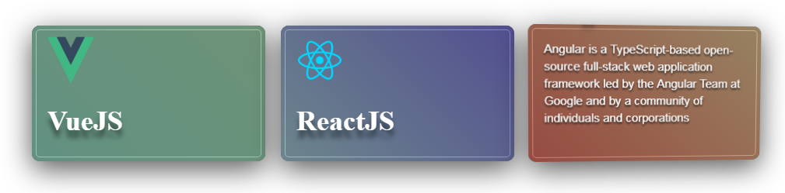

# VUE PWA Cards App

> A Vue.js pwa application with firebase realtime database
  


### Demo
  [https://vue-app-pwa.herokuapp.com](https://vue-app-pwa.herokuapp.com)

## Usage

1 .  Run

- `git clone https://github.com/chnitiibrahim/vue-pwa-app.git
- `cd vue-pwa-app`
- `npm install`

2 .  Create a project at https://firebase.google.com/ and grab your web config:


3 .  Add the config to the firebase.js

#### src/firebase.js
```
const config = {
   apiKey: 'APIKEY',
   authDomain: 'DEV-APP.firebaseapp.com',
   databaseURL: 'https://DEV-APP.firebaseio.com',
   projectId: 'DEV-APP',
   storageBucket: 'DEV-APP.appspot.com',
   messagingSenderId: '012345678'
}
```

4 .  And finally `npm run dev`

5 .  Build for production `npm run build && npm run start`

### Deploy to heroku
```
# clone this repository.
# create projet in heroku, get the repository path

# add heroku as another remote repository
git remote add heroku {heroku repository path} 

# list all your remotes, to ckeck if heroku remote added successfully
git remote
  -- origin
  -- heroku
  
# push your changes to the appropriate remote
git push {remote name} {branch name}

# push your changes to heroku remote to start the deployment
git push heroku master
```


